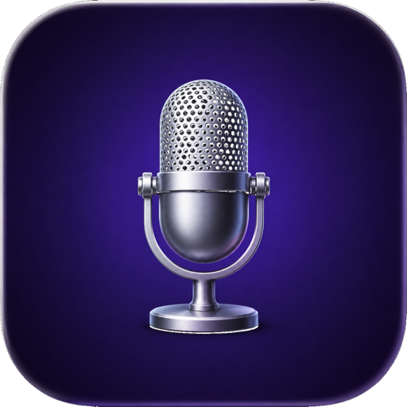

# MeetingMind

**Meetings happen. Notes shouldn't require you to take them.**

[Download for macOS](https://github.com/mathguimaraes/meetingmind/releases/latest) · Apple Silicon · macOS 13+

---

> **🚧 Beta.** MeetingMind works and I use it daily, but it's early — expect rough edges, and please [report anything odd](https://github.com/mathguimaraes/meetingmind/issues). Best suited for people comfortable with that: developers, early adopters, anyone who wants to try it and doesn't need it to be perfect on day one.

---

## The problem

You join a call, and the second it gets interesting you have to choose: pay attention, or write it down. Miss the meeting's start scrambling for a notes app. Forget to hit record. Get to Friday with six meetings' worth of decisions and action items living nowhere but your memory.

Most recording tools make this worse, not better — they need you to remember to press start, they dump raw audio to some server, and half of them can't tell your voice from everyone else's.

## What MeetingMind does

MeetingMind sits quietly in your menu bar and handles the whole thing without being asked:

- **Notices you're in a meeting and starts recording on its own.** No button to remember, no "oh no, was this being recorded" moment.
- **Transcribes it entirely on your Mac.** [WhisperKit](https://github.com/argmaxinc/WhisperKit) runs on the Apple Silicon Neural Engine — audio never leaves your machine.
- **Knows what you said vs. what everyone else said.** Mic and system audio are captured and split separately, so summaries and insights are attributed to the right person.
- **Turns the transcript into something useful** — a title, a bullet summary, action items, and (optionally) an honest read on how you performed in that specific conversation, whether it was a 1:1, a client call, or a design review.
- **Rolls it all up into a daily report** — what happened today, across every meeting, and what you still owe someone.

You bring your own [Gemini API key](https://aistudio.google.com/apikey) for the AI layer (the free tier comfortably covers personal use) — or skip the key entirely and run a local model on-device.

## Why it's built this way

- **Local-first.** Recording and transcription happen on your Mac regardless of whether you ever add an API key. The only thing that can leave your machine is a text transcript, and only if you turn cloud summaries on.
- **No accounts, no subscription.** It's a native app, not a SaaS wrapper. You own the DMG, you own your data.
- **Built for how meetings actually go.** False starts (music, a stray voice message) don't turn into phantom recordings; a dropped mic mid-call doesn't silently lose half your transcript.

## Install

1. Download the latest `MeetingMind.dmg` from [Releases](https://github.com/mathguimaraes/meetingmind/releases/latest).
2. Open the DMG and drag **MeetingMind** into **Applications**.
3. Launch it. macOS will ask for **Microphone** and **Screen Recording** permission — the latter is what captures other participants' audio and triggers the purple recording-indicator dot; that's expected and required.
4. Menu bar icon → **Settings** to add a Gemini API key. Optional — only needed for cloud AI summaries; recording and local transcription work with no key at all.

MeetingMind checks for updates automatically (via [Sparkle](https://sparkle-project.org)) and notifies you in-app when a new version is ready.

## Privacy

Audio and transcripts stay on your Mac. Nothing is sent anywhere unless you turn on a cloud AI provider — and even then, only the transcript text goes out, never raw audio.

## Feedback / Issues

Menu bar icon → **Send Feedback…** in the app, or open an [issue](https://github.com/mathguimaraes/meetingmind/issues) here.
